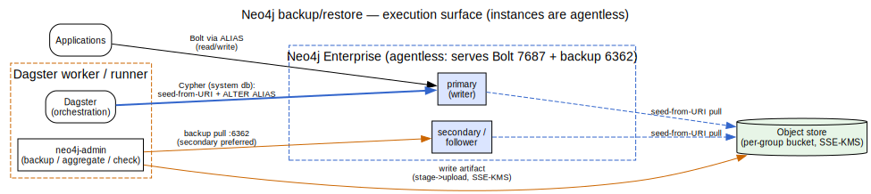
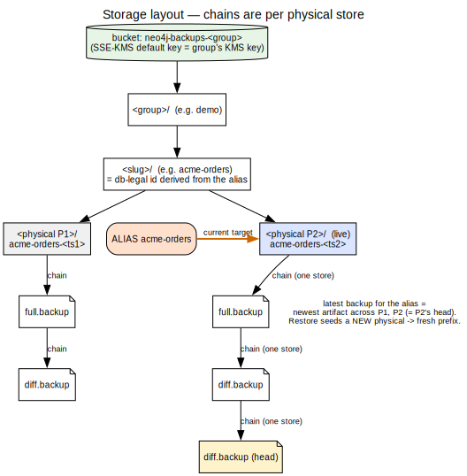
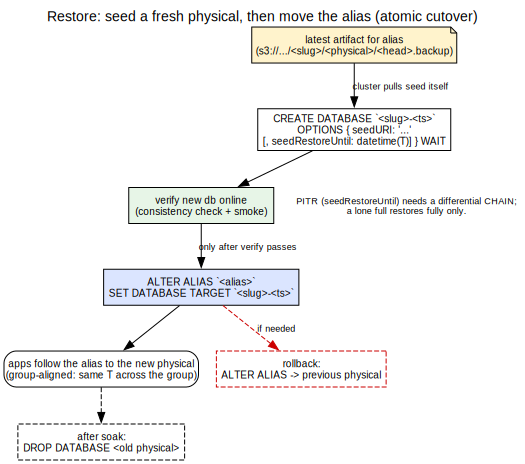
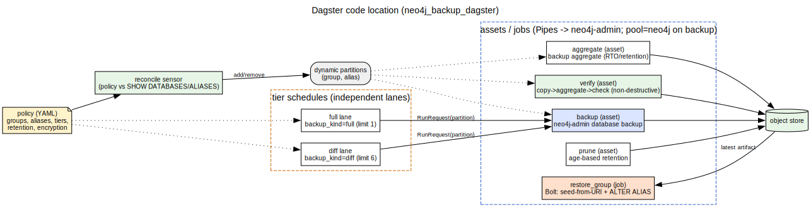
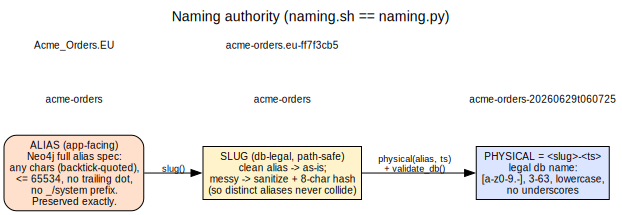

# Diagrams

Graphviz (`.dot`) sources, rendered to SVG. Regenerate with `just diagrams` (from the
repo root) or `./render.sh` here — requires graphviz (`brew install graphviz`).

## Architecture — execution surface

Agentless instances; the runner runs `neo4j-admin` (backup); restore is pure Cypher; DB
nodes pull seeds themselves. Source: [`architecture.dot`](architecture.dot).

## Storage layout

`<group>/<slug>/<physical>/<artifact>.backup` and the per-store backup chains. Source:
[`storage-layout.dot`](storage-layout.dot).

## Restore cutover

Seed a fresh physical → verify → `ALTER ALIAS` → rollback / cleanup. Source:
[`restore-cutover.dot`](restore-cutover.dot).

## Dagster pipeline

The code location: backup / aggregate / verify / prune assets, the restore job, schedules,
and the reconciliation sensor. Source: [`dagster-pipeline.dot`](dagster-pipeline.dot).

## Naming authority

alias → slug → physical, the same contract in `naming.sh` and `naming.py`. Source:
[`naming.dot`](naming.dot).

---

SVGs are generated artifacts; re-render after editing a `.dot`.
